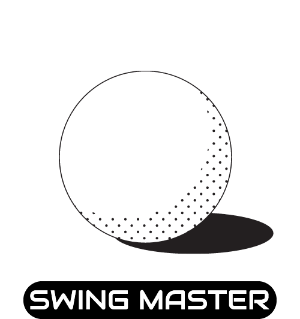

# 
> AI기술을 활용하여 쉽고 간편하게 골프스윙 평가받고 점수 등을 기록하는 프로그램
> 
 [Notion 바로가기](https://hexagonal-subway-115.notion.site/Swing-Master-32d7d806556947e7b16510aecb629a32)

## 바로가기

1. [제작 기간 & 참여 인원](#1-제작-기간--참여-인원)
2. [프로젝트 소개](#2-프로젝트-소개)
3. [프로젝트 시작 이유](#3-프로젝트-시작-이유)
4. [사용 기술](#4-사용-기술)
5. [설치 방법](#5-설치-방법)
6. [UI 프로토타입](#6-ui-프로토타입)
7. [UML](#7-UML)
8. [ERD](#8-ERD)
9. [구현 화면](#9-구현-화면)
10. [핵심 기능](#10-핵심-기능)

 
 

## 1. 제작 기간 & 참여 인원

- 2021년 11월 1일 ~ 12월 27일
- 팀 프로젝트: [권지현](https://github.com/Journey322), [박주환](https://github.com/zuani), [배병규](https://github.com/bbkyoo), [전용우](https://github.com/Scooterr101), [조재효](https://github.com/chojaehyo)

 
 

## 2. 프로젝트 소개

Swing Master는 10초 안에 스윙을 분석해주는 골프 스윙 분석 서비스로, AI기반의 분석을 통해 유저들의 자세 및 스윙 관련 문제점을 자동으로 진단해준다. 시중에 출시된 다른 프로그램들이 여러 스윙을 제공해주는 것과 달리 Swing Master는 드라이버 스윙 집중화를 통해 초보 유저들이 기본 자세를 교정할 수 있도록 돕는다. 또한 유저들의 스윙을 분석하여 7가지 기본 동작들로 수행 여부를 진단하고 이를 점수화하여 유저들 간의 소통 기능을 제공한다. 

 
 

## 3. 프로젝트 시작 이유

골프를 배우는 학습자가 증가하면서 소수 학습자들의 전유물에 불과하던 골프도 대중적인 스포츠로 자리잡게 되었다. 그러나 골프가 대중화 되었음에도 불구하고 비싼 수강료로 인해 지속적이고 깊이있는 학습으로 이어지지 못하고 중도에 포기하는 학습자들이 많다. 이러한 문제를 해결하기 위해 시중에 골프 독학을 위한 프로그램들이 제공되고 있으나 많은 기술들을 복합적으로 제공하여 아마추어 학습자들이 혼자 학습하기에 어려움을 겪고 있다. 아마추어 학습자들이 쉽게 학습을 포기하지 않고 지속적인 학습으로 이어지도록 돕기 위해 드라이버 스윙에 집중한 프로그램을 제공하기 위해 ‘Swing Master’를 개발하였다. 

 
 

## 4. 사용 기술

- Python 3.8.8
- Django 4.0
- Beautifulsoup4 4.10.0
- Mediapipe 0.8.9.1
- Ajax
- MariaDB
- OpenCV
- Chart.js
- JSP

 
 

## 5. 설치 방법

1. clone the repo

2. 가상 환경 
python 3.8버전
<pre>
    -- 윈도우    
python -m venv venv
cd venv/Scripts
activate
</pre>
<pre>
    -- 맥
Python -m venv venv
Source venv/bin/activate
</pre>
3. 패키지 설치
<pre>
pip install -r requirements.txt
</pre>
4. 프로그램 실행 
<pre>
cd SwingMaster/SwingMaster
python manage.py runserver
</pre>
5. DB변경
<pre>
- SwingMaster > settings.py의 DATABASES 변경
DATABASES = {
    'default': {
        'ENGINE': 'django.db.backends.sqlite3',
        'NAME': BASE_DIR / 'db.sqlite3',
    }
}
</pre>
<pre>
python manage.py makemigrations
python manage.py migrate
</pre>

 
 

## 6. UI 프로토타입

[Swing Master Design모음](https://www.notion.so/d9eb0ecd1f6f41d290618ffeb3978058?v=ee9d8f63e653440f9a79295bb22514a6)

 
 

## 7. UML

 
 

## 8. ERD

 
 

## 9. 구현 화면

 
 

## 10. 핵심 기능

- 골프스윙을 촬영할 카메라 구현
- 유저들의 골프스윙을 점수화
- 골프점수에 따른 미니게임
- 유저들의 랭킹표
- 개인의 최근 6개 점수차트

